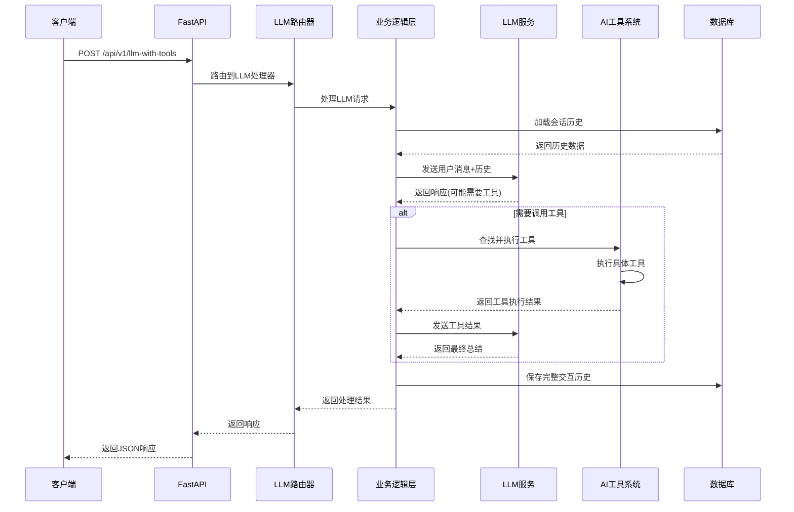
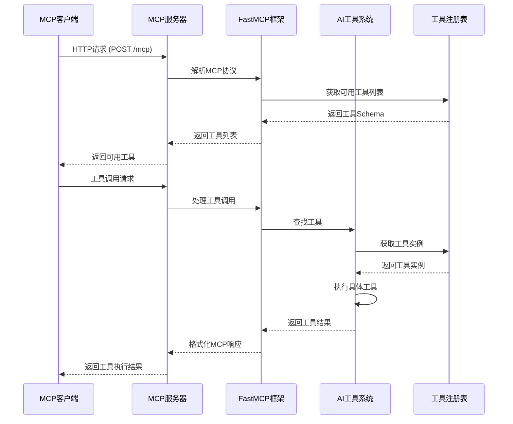

# Genesis AI App

<div align="center">


**企业级AI应用开发的终极启动器**

基于FastAPI和清洁架构构建，集成了LLM服务、MCP协议支持和完整的开发工具链。

[功能特性](#-特性) • [技术栈](#-技术栈) • [快速开始](#-快速开始) • [架构概览](#-架构概览) • [文档](#-文档) • [贡献](#-贡献)

</div>

---

## ✨ 特性

- 🚀 **现代化架构**: 基于FastAPI + SQLAlchemy + Alembic的清洁架构
- 🔧 **依赖注入**: 使用`dependency-injector`实现IoC容器
- 🤖 **LLM集成**: 支持OpenAI、千问等多厂商LLM服务
- 🔌 **MCP协议**: 完整的Model Context Protocol服务器实现
- 🛠️ **AI工具系统**: 可扩展的AI工具插件架构
- 🗄️ **数据库管理**: PostgreSQL + 自动迁移系统
- 📊 **监控日志**: 结构化日志和性能监控
- 🐳 **Docker支持**: 完整的容器化部署方案
- 🧪 **测试覆盖**: 单元测试、集成测试、E2E测试
- 📚 **完整文档**: CLAUDE.md开发指南 + API文档
- 🏗️ **架构设计**: 清洁架构 + 依赖注入 + 插件化AI工具

## 🔧 技术栈

### 后端技术栈
| 类别 | 技术 | 用途 |
|------|------|------|
| **Web框架** | FastAPI | 异步REST API框架 |
| **ORM** | SQLAlchemy + Alembic | 数据库操作和迁移 |
| **数据库** | PostgreSQL | 主数据存储 |
| **依赖注入** | dependency-injector | IoC容器管理 |
| **异步驱动** | asyncpg | PostgreSQL异步驱动 |

### AI/LLM技术栈
| 类别 | 技术 | 用途 |
|------|------|------|
| **LLM服务** | OpenAI API | GPT模型集成 |
| **LLM服务** | 阿里云千问 | 中文大模型支持 |
| **协议框架** | FastMCP | Model Context Protocol实现 |
| **工具系统** | 自研AI工具系统 | 插件化工具注册和执行 |
| **函数调用** | OpenAI Function Calling | LLM工具调用 |

### 开发和部署技术栈
| 类别 | 技术 | 用途 |
|------|------|------|
| **包管理** | Poetry | 依赖管理和打包 |
| **容器化** | Docker + Docker Compose | 容器化部署 |
| **测试框架** | pytest + pytest-asyncio | 单元测试和集成测试 |
| **代码质量** | Black + Ruff + MyPy | 代码格式化和检查 |
| **CI/CD** | GitLab CI | 持续集成和部署 |
| **监控** | structlog + OpenTelemetry | 日志和性能监控 |

### 架构模式和设计原则
- **清洁架构**: 严格的分层架构 (apps → business_logic → infrastructure)
- **依赖注入**: 使用IoC容器降低模块耦合
- **插件化设计**: AI工具系统支持动态注册和扩展
- **异步优先**: 全栈异步支持，高并发处理
- **配置驱动**: 环境感知的配置管理系统

## 🏗️ 架构概览

```
genesis-ai-app/
├── apps/                    # 应用层
│   ├── rest_api/           # FastAPI REST API
│   └── mcp_server/         # MCP服务器
├── src/genesis/            # 核心业务逻辑
│   ├── core/              # 核心服务和工具
│   ├── business_logic/    # 业务逻辑层
│   ├── infrastructure/    # 基础设施层
│   └── ai_tools/          # AI工具系统
├── sql/                   # 数据库脚本
├── scripts/               # 管理脚本
├── tests/                 # 测试套件
├── docs/                  # API文档
├── config/                # 配置文件
└── deployment/            # 部署配置
```

### 核心组件

- **应用层**: 处理HTTP请求和MCP协议
- **业务逻辑层**: 实现核心业务规则
- **基础设施层**: 数据库、LLM服务、外部集成
- **AI工具系统**: 可扩展的工具注册和执行

### 📊 详细架构图

完整的架构设计文档请查看：[架构文档](docs/ARCHITECTURE.md)

包含以下内容：
- 🏗️ **技术栈总览**: 后端、AI/LLM、开发部署技术栈
- 🖼️ **系统架构图**: 完整的系统组件和交互关系
- ⏱️ **REST API时序图**: 请求处理流程和工具调用
- ⏱️ **MCP服务器时序图**: MCP协议处理流程
- 🌊 **数据流架构图**: 数据在系统中的流向
- 🚀 **部署架构图**: 生产环境部署方案

### 核心架构特点

- **分层架构**: 应用层 → 业务逻辑层 → 基础设施层
- **双服务模式**: REST API (8000端口) + MCP服务器 (8888端口)
- **工具共享**: REST API和MCP服务器共享AI工具注册表
- **异步处理**: 全栈异步支持，高并发处理能力
- **依赖注入**: 使用dependency-injector实现IoC容器
- **插件化设计**: AI工具系统支持动态注册和扩展

## 🚀 快速开始

### 环境要求

- Python 3.10+
- PostgreSQL 12+
- Poetry (推荐) 或 pip

### 安装步骤

1. **克隆项目**
   ```bash
   git clone https://github.com/SolidFoundry/genesis-ai-app.git
   cd genesis-ai-app
   ```

2. **安装依赖**
   ```bash
   # 使用Poetry (推荐)
   poetry install
   
   # 或使用pip
   pip install -r requirements.txt
   ```

3. **配置环境**
   ```bash
   cp .env.example .env
   # 编辑.env文件，配置数据库和API密钥
   ```

4. **启动数据库**
   ```bash
   docker-compose up -d
   ```

5. **初始化数据库**
   ```bash
   python run.py --auto-init
   ```

6. **启动应用**
   ```bash
   # 开发模式
   python run.py --reload
   
   # 或使用Windows脚本
   start.bat
   ```

7. **验证运行**
   - 访问 http://localhost:8000/docs 查看API文档
   - 访问 http://localhost:8000/health 检查健康状态
   - MCP服务器运行在 http://localhost:8888/mcp

## 📚 开发指南

### 可用命令

#### 应用管理
```bash
# 启动应用
python run.py --help                    # 查看帮助
python run.py --reload                 # 开发模式（热重载）
python run.py --port 8000              # 指定端口
python run.py --init-db                 # 初始化数据库
python run.py --init-sample             # 初始化示例数据
python run.py --auto-init               # 自动初始化并启动

# Windows快捷脚本
start.bat                              # 启动应用
stop.bat                               # 停止应用
```

#### MCP服务器
```bash
# 启动MCP服务器
python -m apps.mcp_server.main          # 直接启动
scripts/mcp_start.bat                   # Windows启动脚本
scripts/mcp_start.sh                    # Linux/Mac启动脚本

# MCP服务器配置
# 默认端口: 8888
# 访问地址: http://127.0.0.1:8888/mcp
```

#### 数据库管理
```bash
# 数据库迁移
make db-migrate                         # 运行迁移
make db-downgrade                       # 回滚迁移
make db-revision                        # 创建新迁移

# 数据库脚本
sql/001_initial_schema.sql             # 初始表结构
sql/002_sample_data.sql                # 示例数据
```

#### 测试和代码质量
```bash
# 测试
make test                               # 运行所有测试
make test-unit                          # 单元测试
make test-integration                   # 集成测试
make test-e2e                           # E2E测试
make test-coverage                      # 测试覆盖率

# 代码质量
make lint                               # 代码检查
make format                             # 代码格式化
make security                           # 安全检查
```

### 项目结构详解

#### 应用层 (`apps/`)
- **rest_api/**: FastAPI REST API实现
  - `main.py` - 应用入口和路由配置
  - `v1/routers/` - API路由定义
  - `v1/schemas/` - 数据模型定义

- **mcp_server/**: MCP协议服务器
  - `main.py` - MCP服务器入口
  - `v1/tools/` - MCP工具实现

#### 核心层 (`src/genesis/`)
- **core/**: 核心服务和配置
  - `settings.py` - 配置管理
  - `container.py` - 依赖注入容器
  - `middleware.py` - 中间件

- **business_logic/**: 业务逻辑
  - 领域服务和业务规则

- **infrastructure/**: 基础设施
  - `database/` - 数据库管理
  - `llm/` - LLM服务集成
  - 外部服务适配器

- **ai_tools/**: AI工具系统
  - `registry.py` - 工具注册中心
  - 各种AI工具实现

## 🔧 配置说明

### 环境变量

```env
# 数据库配置
DATABASE_HOST=localhost
DATABASE_PORT=5432
DATABASE_NAME=genesis_db
DATABASE_USER=genesis
DATABASE_PASSWORD=genesis_password

# LLM配置
OPENAI_API_KEY=your_openai_key
OPENAI_MODEL=gpt-3.5-turbo
QWEN_API_KEY=your_qwen_key

# 应用配置
APP_ENV=development
DEBUG=true

# MCP服务器配置
MCP_PORT=8888
MCP_HOST=127.0.0.1
```

### 配置文件优先级

1. 环境变量 (最高优先级)
2. `.env` 文件
3. 配置文件默认值

## 🧪 测试

### 测试结构

```
tests/
├── unit/              # 单元测试
├── integration/       # 集成测试
└── e2e/              # 端到端测试
```

### 运行测试

```bash
# 所有测试
make test

# 特定测试类型
make test-unit          # 单元测试
make test-integration   # 集成测试
make test-e2e          # 端到端测试

# 带覆盖率报告
make test-coverage
```

## 📊 API文档

启动应用后访问：

- **Swagger UI**: http://localhost:8000/docs
- **ReDoc**: http://localhost:8000/redoc
- **OpenAPI Schema**: http://localhost:8000/openapi.json

### 主要端点

| 端点 | 方法 | 描述 |
|------|------|------|
| `/` | GET | 应用信息 |
| `/health` | GET | 健康检查 |
| `/api/v1/llm-with-tools` | POST | LLM工具调用 |
| `/api/v1/mcp/*` | POST/GET | MCP相关接口 |
| `/v1/_debug/*` | GET | 调试端点 |

## 🚀 部署

### Docker部署

```bash
# 构建镜像
docker build -t genesis-ai-app .

# 启动服务
docker-compose up -d
```

### 生产环境配置

1. **环境变量**
   ```bash
   export APP_ENV=production
   export DEBUG=false
   ```

2. **启动服务**
   ```bash
   python run.py --env production
   # 或使用多进程
   make run-prod
   ```

3. **数据库**
   - 使用外部PostgreSQL服务
   - 配置适当的连接池大小
   - 启用SSL连接

## 🔧 开发工具

### 代码质量工具

- **Black**: 代码格式化
- **Ruff**: 快速linting
- **MyPy**: 类型检查
- **isort**: 导入排序

### 开发环境设置

```bash
# 安装pre-commit钩子
pre-commit install

# 运行代码检查
make lint
make format

# 运行所有检查
make check
```

### 📊 架构图和时序图

项目包含详细的架构文档，位于 `docs/ARCHITECTURE.md`：

#### REST API 时序图


#### MCP 服务器时序图


### CLAUDE.md 开发指南

项目包含详细的 `CLAUDE.md` 文件，为未来的Claude Code实例提供：

- 完整的开发命令参考
- 架构概述和设计模式
- 配置管理说明
- 测试和部署指南

## 🤝 贡献指南

我们欢迎任何形式的贡献！

### 开发流程

1. Fork项目
2. 创建特性分支
   ```bash
   git checkout -b feature/amazing-feature
   ```
3. 提交更改
   ```bash
   git commit -m 'Add amazing feature'
   ```
4. 推送到分支
   ```bash
   git push origin feature/amazing-feature
   ```
5. 创建Pull Request

### 代码规范

- 遵循PEP 8规范
- 使用Black格式化代码
- 添加类型注解
- 编写测试用例
- 更新文档

## 📝 更新日志

### v1.0.0 (2025-09-05)

#### ✨ 新增功能
- 🏗️ 完整的清洁架构实现
- 🔌 MCP协议服务器支持 (端口8888)
- 🤖 多LLM厂商集成 (OpenAI, 千问)
- 🛠️ AI工具系统和插件架构
- 📊 结构化日志和性能监控
- 🧪 完整的测试覆盖

#### 🔧 技术栈
- FastAPI + SQLAlchemy + Alembic
- dependency-injector IoC容器
- PostgreSQL数据库
- FastMCP协议实现
- Poetry依赖管理
- Docker容器化

#### 📚 文档
- 完整的README文档
- CLAUDE.md开发指南
- API文档集成
- 数据库设置指南
- MCP集成指南

## 📄 许可证

本项目采用 [MIT许可证](LICENSE) - 查看 [LICENSE](LICENSE) 文件了解详情。

## 🙏 致谢

感谢以下优秀的开源项目：

- [FastAPI](https://fastapi.tiangolo.com/) - 现代化的Python Web框架
- [SQLAlchemy](https://www.sqlalchemy.org/) - Python SQL工具包
- [FastMCP](https://github.com/jlowes/fastmcp) - MCP协议实现
- [Poetry](https://python-poetry.org/) - Python依赖管理
- [Pydantic](https://docs.pydantic.dev/) - 数据验证和设置管理

## 📞 支持

- 📧 创建Issue报告问题
- 📖 查看 [CLAUDE.md](CLAUDE.md) 了解开发详情
- 🌐 访问项目Wiki获取更多文档

---

<div align="center">

**Genesis AI App** - 让AI应用开发更简单！ 🚀

[⭐ Star这个项目](https://github.com/your-username/genesis-ai-app) • [🐛 报告问题](https://github.com/your-username/genesis-ai-app/issues) • [💡 提出新功能](https://github.com/your-username/genesis-ai-app/issues)

</div>