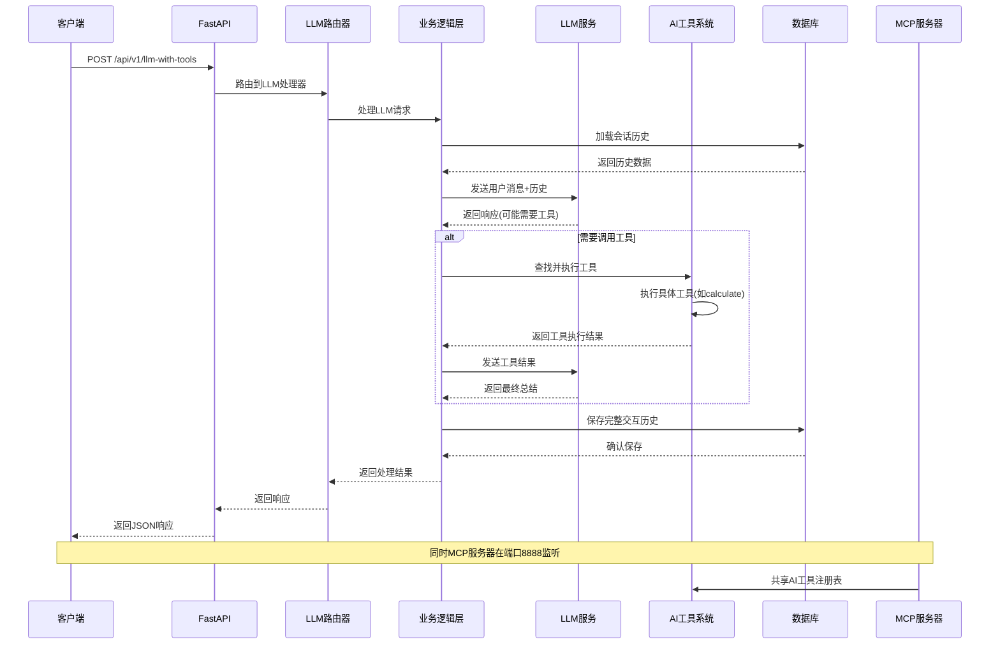
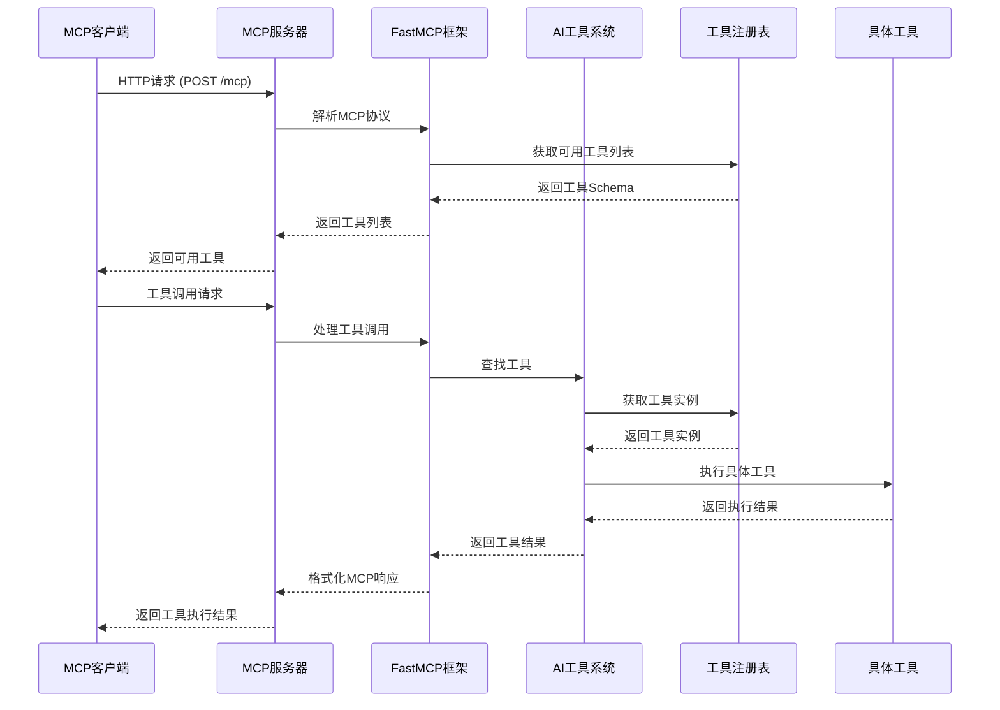

# Genesis AI App 架构图

## 技术栈总览

### 后端技术栈
```
┌─────────────────────────────────────────────────────────────┐
│                    后端技术栈                                 │
├─────────────────────────────────────────────────────────────┤
│  ┌─────────────────┐  ┌─────────────────┐  ┌─────────────────┐ │
│  │   FastAPI      │  │   SQLAlchemy   │  │  PostgreSQL    │ │
│  │   (Web框架)     │  │   (ORM框架)    │  │   (数据库)     │ │
│  └─────────────────┘  └─────────────────┘  └─────────────────┘ │
│                                                                 │
│  ┌─────────────────┐  ┌─────────────────┐  ┌─────────────────┐ │
│  │dependency-inject│  │     Alembic    │  │     FastMCP    │ │
│  │   (IoC容器)     │  │   (数据库迁移)  │  │  (MCP协议)     │ │
│  └─────────────────┘  └─────────────────┘  └─────────────────┘ │
└─────────────────────────────────────────────────────────────┘
```

### AI/LLM技术栈
```
┌─────────────────────────────────────────────────────────────┐
│                    AI/LLM技术栈                              │
├─────────────────────────────────────────────────────────────┤
│  ┌─────────────────┐  ┌─────────────────┐  ┌─────────────────┐ │
│  │    OpenAI       │  │     Qwen       │  │  AI Tools      │ │
│  │    (GPT模型)    │  │   (千问模型)   │  │   (工具系统)   │ │
│  └─────────────────┘  └─────────────────┘  └─────────────────┘ │
│                                                                 │
│  ┌─────────────────┐  ┌─────────────────┐  ┌─────────────────┐ │
│  │  Tool Registry  │  │  Function Call  │  │  Session Mgmt   │ │
│  │  (工具注册)     │  │  (函数调用)     │  │  (会话管理)   │ │
│  └─────────────────┘  └─────────────────┘  └─────────────────┘ │
└─────────────────────────────────────────────────────────────┘
```

### 开发和部署技术栈
```
┌─────────────────────────────────────────────────────────────┐
│                  开发和部署技术栈                            │
├─────────────────────────────────────────────────────────────┤
│  ┌─────────────────┐  ┌─────────────────┐  ┌─────────────────┐ │
│  │     Poetry     │  │     Docker     │  │    pytest      │ │
│  │   (包管理)     │  │   (容器化)     │  │   (测试框架)   │ │
│  └─────────────────┘  └─────────────────┘  └─────────────────┘ │
│                                                                 │
│  ┌─────────────────┐  ┌─────────────────┐  ┌─────────────────┐ │
│  │   Black/Ruff    │  │     GitLab CI   │  │  Monitoring     │ │
│  │   (代码质量)    │  │   (CI/CD)       │  │   (监控)       │ │
│  └─────────────────┘  └─────────────────┘  └─────────────────┘ │
└─────────────────────────────────────────────────────────────┘
```

## 系统架构图

```
┌─────────────────────────────────────────────────────────────────────────────────┐
│                                用户界面层                                          │
├─────────────────────────────────────────────────────────────────────────────────┤
│  ┌─────────────────┐                    ┌─────────────────┐                      │
│  │   Web Browser  │                    │   API Client    │                      │
│  │   (Swagger UI) │                    │   (cURL/Postman)│                      │
│  └─────────────────┘                    └─────────────────┘                      │
└─────────────────────────────────────────────────────────────────────────────────┘
                                      │
                                      ▼
┌─────────────────────────────────────────────────────────────────────────────────┐
│                                应用层 (Apps)                                      │
├─────────────────────────────────────────────────────────────────────────────────┤
│  ┌─────────────────────────────────────────┐  ┌─────────────────────────────┐   │
│  │           REST API (Port 8000)           │  │        MCP Server (Port 8888)   │   │
│  │  ┌─────────────────────────────────────┐ │  │  ┌─────────────────────────┐   │   │
│  │  │         FastAPI Application         │ │  │  │     FastMCP Server      │   │   │
│  │  │  ┌─────────────┐ ┌─────────────────┐ │ │  │  │ ┌─────────────────┐     │   │   │
│  │  │  │   Routers   │ │   Middlewares   │ │ │  │  │ │     Tools      │     │   │   │
│  │  │  │ ┌─────────┐ │ │ ┌─────────────┐ │ │ │  │  │ │ ┌─────────────┐ │     │   │   │
│  │  │  │ │LLM Router│ │ │ │Request ID  │ │ │ │  │  │ │ │Basic Tools │ │     │   │   │
│  │  │  │ │MCP Router│ │ │ │Timing      │ │ │ │  │  │ │ └─────────────┘ │     │   │   │
│  │  │  │ │Debug Rout│ │ │ │DB Session  │ │ │ │  │  │ └─────────────────┘     │   │   │
│  │  │  │ └─────────┘ │ │ └─────────────┘ │ │ │  │  └─────────────────────────┘   │   │
│  │  │  └─────────────┘ └─────────────────┘ │ │  └─────────────────────────────┘   │
│  │  └─────────────────────────────────────┘ │                                    │
│  └─────────────────────────────────────────┘                                    │
└─────────────────────────────────────────────────────────────────────────────────┘
                    │                                    │
                    └────────────┬───────────────────────┘
                                 ▼
┌─────────────────────────────────────────────────────────────────────────────────┐
│                            核心业务逻辑层                                        │
├─────────────────────────────────────────────────────────────────────────────────┤
│  ┌─────────────────────────────────────────────────────────────────────────────┐ │
│  │                        Core Services                                        │ │
│  │  ┌─────────────┐ ┌─────────────┐ ┌─────────────┐ ┌─────────────────┐       │ │
│  │  │   Settings  │ │  Container  │ │Middlewares │ │  AI Tools       │       │ │
│  │  │   (配置)    │ │  (IoC容器)  │ │ (中间件)    │ │  (工具注册)     │       │ │
│  │  └─────────────┘ └─────────────┘ └─────────────┘ └─────────────────┘       │ │
│  └─────────────────────────────────────────────────────────────────────────────┘ │
│                                                                                   │
│  ┌─────────────────────────────────────────────────────────────────────────────┐ │
│  │                    Business Logic                                             │ │
│  │  ┌─────────────────────────────────────────────────────────────────────────┐ │ │
│  │  │                    业务规则和领域逻辑                                      │ │ │
│  │  └─────────────────────────────────────────────────────────────────────────┘ │ │
│  └─────────────────────────────────────────────────────────────────────────────┘ │
└─────────────────────────────────────────────────────────────────────────────────┘
                                 │
                                 ▼
┌─────────────────────────────────────────────────────────────────────────────────┐
│                            基础设施层                                            │
├─────────────────────────────────────────────────────────────────────────────────┤
│  ┌─────────────────────────────────────────┐  ┌─────────────────────────────┐   │
│  │            Database Layer               │  │        LLM Services         │   │
│  │  ┌─────────────────────────────────────┐ │  │  ┌─────────────────────────┐   │   │
│  │  │        PostgreSQL Database           │ │  │  │ ┌─────────────────┐     │   │   │
│  │  │  ┌─────────────┐ ┌─────────────────┐ │ │  │  │ │   OpenAI API   │     │   │   │
│  │  │  │ConnectionPool│ │   Session Mgmt   │ │ │  │  │ │   (GPT模型)    │     │   │   │
│  │  │  └─────────────┘ └─────────────────┘ │ │  │  │ └─────────────────┘     │   │   │
│  │  │  ┌─────────────┐ ┌─────────────────┐ │ │  │  │ ┌─────────────────┐     │   │   │
│  │  │  │    Models   │ │   Migrations    │ │ │  │  │ │   Qwen API    │     │   │   │
│  │  │  └─────────────┘ └─────────────────┘ │ │  │  │ │  (千问模型)    │     │   │   │
│  │  └─────────────────────────────────────┘ │  │  │ └─────────────────┘     │   │   │
│  └─────────────────────────────────────────┘  └─────────────────────────────┘   │
└─────────────────────────────────────────────────────────────────────────────────┘
```

## REST API 时序图



## MCP 服务器时序图



## 数据流架构图

```
┌─────────────────────────────────────────────────────────────────────────────────┐
│                                  数据流向                                         │
├─────────────────────────────────────────────────────────────────────────────────┤
│                                                                                 │
│  用户输入 ──→ REST API ──→ 路由处理 ──→ 业务逻辑 ──→ LLM服务                       │
│     │                                              │                           │
│     │                                              ▼                           │
│     │                                        工具调用判断                       │
│     │                                              │                           │
│     │                                              ▼                           │
│     │                                      AI工具系统执行                       │
│     │                                              │                           │
│     │                                              ▼                           │
│     │                                      工具结果处理                       │
│     │                                              │                           │
│     │                                              ▼                           │
│     └───────────────← LLM总结响应 ←────────────── 业务逻辑 ←────────────────────┘
│                           │
│                           ▼
│                     数据库存储
│                           │
│                           ▼
│                     会话历史管理
│                           │
│                           ▼
│                     响应返回用户
│                                                                                 │
│  MCP数据流:                                                                     │
│  MCP客户端 ──→ MCP服务器 ──→ FastMCP ──→ 工具注册表 ──→ 工具执行 ──→ 结果返回    │
│                                                                                 │
└─────────────────────────────────────────────────────────────────────────────────┘
```

## 部署架构图

```
┌─────────────────────────────────────────────────────────────────────────────────┐
│                                  生产环境                                        │
├─────────────────────────────────────────────────────────────────────────────────┤
│                                                                                 │
│  ┌─────────────────────────────────────────────────────────────────────────────┐ │
│  │                            负载均衡器                                       │ │
│  │                          (Nginx/ALB)                                        │ │
│  └─────────────────────────────────────────────────────────────────────────────┘ │
│                                        │                                        │
│                   ┌──────────────────┼──────────────────┐                      │
│                   ▼                  ▼                  ▼                      │
│  ┌─────────────────────────────┐ ┌─────────────────────────────┐ ┌─────────────┐ │
│  │      REST API 节点          │ │      MCP 节点             │ │   监控系统   │ │
│  │   (Port 8000, 多实例)       │ │   (Port 8888, 多实例)      │ │ (Prometheus)│ │
│  └─────────────────────────────┘ └─────────────────────────────┘ └─────────────┘ │
│                   │                  │                                                │
│                   └──────────────────┼──────────────────┐                      │
│                                      ▼                  ▼                      │
│  ┌─────────────────────────────────────────────────────────────────────────────┐ │
│  │                            数据库集群                                         │ │
│  │                    (PostgreSQL + PgBouncer)                                  │ │
│  └─────────────────────────────────────────────────────────────────────────────┘ │
│                                                                                 │
│  ┌─────────────────────────────────────────────────────────────────────────────┐ │
│  │                            缓存层                                            │ │
│  │                         (Redis Cluster)                                      │ │
│  └─────────────────────────────────────────────────────────────────────────────┘ │
│                                                                                 │
│  ┌─────────────────────────────────────────────────────────────────────────────┐ │
│  │                            消息队列                                          │ │
│  │                      (RabbitMQ/Kafka)                                       │ │
│  └─────────────────────────────────────────────────────────────────────────────┘ │
└─────────────────────────────────────────────────────────────────────────────────┘
```

## 技术架构特点

### 1. 分层架构
- **应用层**: 处理HTTP请求和MCP协议
- **业务逻辑层**: 核心业务规则和流程
- **基础设施层**: 数据存储、外部服务集成

### 2. 依赖注入
- 使用`dependency-injector`实现IoC容器
- 降低模块间耦合度
- 提高代码可测试性

### 3. 插件化设计
- AI工具系统支持动态注册
- 易于扩展新功能
- 工具与业务逻辑解耦

### 4. 异步架构
- 全栈异步支持
- 高并发处理能力
- 非阻塞I/O操作

### 5. 可观测性
- 结构化日志记录
- 性能监控和追踪
- 健康检查机制

这个架构设计确保了系统的可扩展性、可维护性和高可用性，适合企业级AI应用的开发需求。